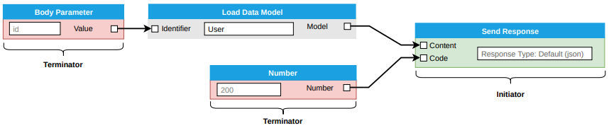

# Command Processor

[](https://travis-ci.com/c-butcher/command-processor)
[](https://travis-ci.com/c-butcher/command-processor)

## Documentation
- [Installation](#installation)
- [Definitions](#definitions)
- [Processes](docs/processes.md)
- [Commands](docs/commands.md)
- [Dispatchers](docs/dispatchers.md)
- [Inputs](#input-object)
  - [Sanitation](docs/sanitizers.md)
  - [Validation](docs/validators.md)

## Installation
First you'll need to have NodeJS installed on your computer. Then you can install our command-processor module
by opening your terminal and typing the following command...

```bash
> npm install --save command-processor
```

## Definitions
| Word       | Definition |
|------------|------------|
| Process    | A group of commands working together towards a purpose. |
| Command    | Single unit-of-work that accepts inputs and returns outputs. |
| Input      | An input is a command that when executed returns the input values that are used in another command. |
| Dispatcher | A container for all the application level services like databases, template, mailers, etc. |
| Processing | The execution and transfer of data from one command to the next |
| Branch     | Branches are created when a command executes two or more inputs commands. | 

## Processes
All processes have some type of end-goal, such as a web application returning an HTTP response,
or a CLI application returning an exit code. We use these end-goal as the **initiator**
command, and it's where we will start building our process from. This command is highlighted
with green in the image below....



The **terminator** commands are used to complete the execution of a branch. Terminator are commands that don't have any
-required- inputs, and can be executed without having to depend on any other commands. 

### Input Object
| Option      | Required | Default  |Type               | Description |
|-------------|:--------:|----------|-------------------|------------------------------------------------------------------------|
| key         | No       | null     | string            | The computer readable name with only letters, numbers and underscores. |
| name        | Yes      | null     | string            | The human-readable name of the command.                                |
| type        | Yes      | 'string' | string            | The type of data that will be stored in this input.                    |
| lookup      | Yes      | null     | string            | The name of the output which is coming from the input command.         |
| description | No       | null     | string            | Tells the end-user what the command does.                              |
| command     | Yes      | null     | Command           | The command that will return our input value.                          |
| required    | No       | false    | boolean           | Tells whether this input is required.                                  |
| sanitize    | No       | null     | function / object | Contains a sanitation function, or an object with sanitation options.  |
| validate    | No       | null     | function / object | Contains a validation function, or an object with validation options.  |


### Validation and Sanitation
The command processor does not have any validation or sanitation built-in directly, but we do have
an event system for handling both of these issues. The easiest way to get sanitation and validation working
is to install the [data-sanitizers](https://github.com/c-butcher/data-sanitizers) and/or
[data-validators](https://github.com/c-butcher/data-validators) packages.

```bash
> npm install --save data-sanitizers
> npm install --save data-validators
```

The command processor will detect the packages above and start using them immediately without having
to do any configuration. Pretty neat, right?

We also know that sometimes our sanitation and validation packages won't be the solution that you're looking for,
in which case you can check out how to create custom [sanitizers](docs/sanitizers.md) and [validators](docs/validators.md)
for your project.
